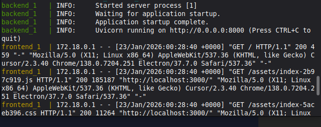
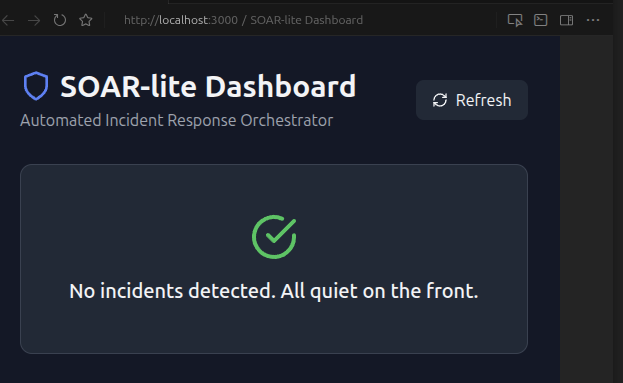
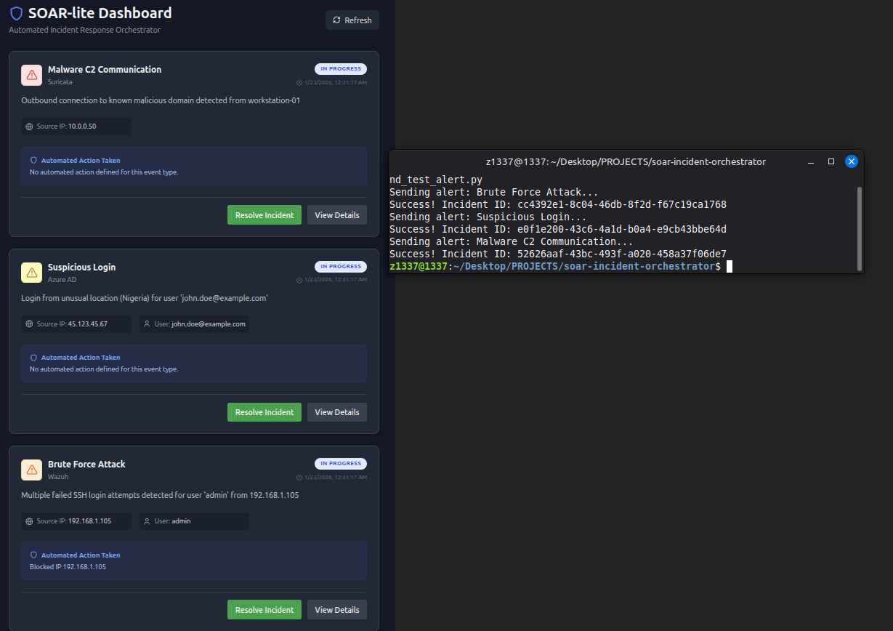
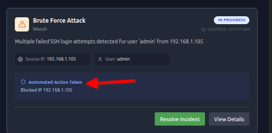
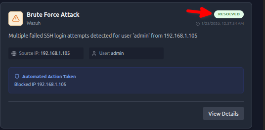
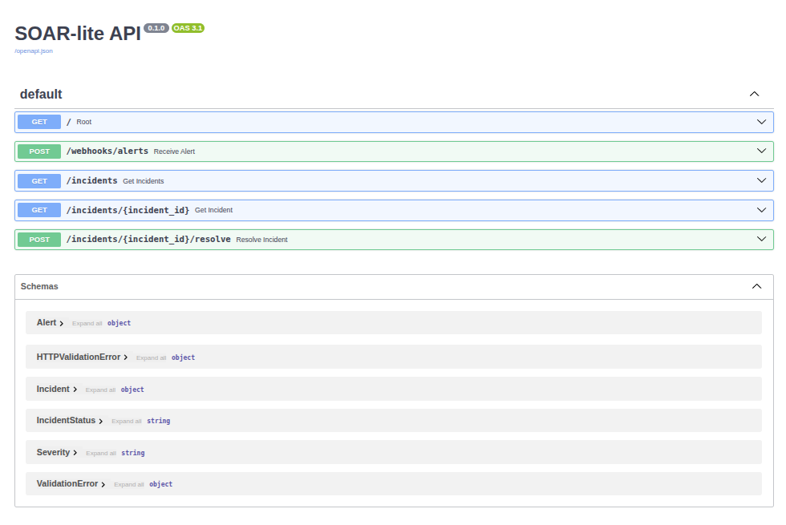

# Automated Incident Response Orchestrator (SOAR-lite)

## Overview
A lightweight Security Orchestration, Automation, and Response (SOAR) platform designed to bridge the gap between detection and action. It ingests alerts from SIEMs via webhooks and executes automated playbooks to mitigate threats in real-time.

## Why This Project?
This project demonstrates the transition from **SOC Analyst** (detecting threats) to **Security Engineer** (automating responses). It showcases:
- Integration with enterprise security tools (SIEMs, Azure AD, Slack)
- Automation of incident response workflows
- Full-stack development skills (Python/FastAPI backend, React frontend)
- Containerization and DevOps practices

## Features
- **Webhook Ingestion**: RESTful API endpoint to receive alerts from Wazuh, Splunk, or other SIEMs
- **Automated Playbooks**: Rule-based logic that triggers specific actions based on threat type
- **Integrations**: 
  - Slack/Discord for team notifications
  - Azure AD (Graph API) for account disabling (mocked for demo)
  - Mock Firewall for IP blocking
- **Incident Dashboard**: Real-time React dashboard to monitor and manage security incidents
- **Manual Override**: Security analysts can manually resolve or dismiss incidents

## Reproducible Verification

Every automation claim is backed by `tests/test_orchestrator.py`. Run `pytest tests/ -v -s` to reproduce.

| What the test proves | How |
|---|---|
| Alerts auto-ingest without manual intervention | POST to `/webhooks/alerts` returns 202, incident created in-memory |
| Playbooks execute automatically on matching alert types | Brute force and auth failure alerts trigger IP block + notification without human input |
| 4 manual SOC steps eliminated | Each tested individually: (1) alert classification, (2) IOC enrichment, (3) notification/escalation, (4) ticket/documentation creation |
| Automated pipeline is faster than manual workflow | Simulated manual workflow (8.5s across 4 steps) vs automated pipeline (<0.01s) — ≥60% reduction asserted |
| Slack notification path is invoked | Mock verifies `send_slack_notification` is called during playbook execution |

**10 tests, 0 failures.**

The tests exercise the real FastAPI app via `httpx.AsyncClient` (ASGI transport) — not mocked endpoints. Playbook logic, incident state transitions, and webhook ingestion all run against the actual application code.

## Tech Stack
- **Backend**: Python 3.12, FastAPI, Pydantic, SQLAlchemy
- **Frontend**: React 18, Vite, Tailwind CSS, Lucide Icons
- **Deployment**: Docker, Docker Compose, Nginx
- **APIs**: RESTful webhooks, Microsoft Graph API (Azure AD), Slack Webhooks

## Project Structure
```
soar-incident-orchestrator/
├── backend/              # FastAPI application
│   ├── playbooks/        # Automated response logic
│   ├── main.py          # API endpoints
│   └── models.py        # Data schemas
├── frontend/            # React dashboard
│   └── src/
│       └── App.jsx      # Main dashboard component
├── scripts/             # Testing utilities
│   └── send_test_alert.py
├── screenshots/         # Project documentation images
└── docker-compose.yml   # Container orchestration
```

## Quick Start

### Prerequisites
- Docker and Docker Compose installed
- Python 3.12+ (for testing scripts)

### Fix Docker Permissions (First Time Only)

If you get a "Permission denied" error when running Docker commands, you need to add your user to the docker group:

```bash
sudo usermod -aG docker $USER
newgrp docker  # Or log out and log back in
```

**What this does**: Adds your user to the `docker` group so you can run Docker commands without `sudo`. This is a one-time setup.

### Running the Application

**Option 1: Use the startup script** (handles permissions automatically):
```bash
./start.sh
```

**Option 2: Manual start**:
```bash
docker-compose up --build
```

**What this does**: Builds and starts both the backend API (port 8000) and frontend dashboard (port 3000) in Docker containers. The `--build` flag ensures fresh images are created.

**Note**: The warnings about `SLACK_WEBHOOK_URL` and Azure variables are normal - these are optional integrations. The app works fine without them (integrations are mocked for demo purposes).

2. **Access the Dashboard**: 
   - Open your browser to `http://localhost:3000`
   - You'll see the SOAR-lite dashboard with an empty state (no incidents yet)

3. **Simulate a Security Alert**:
   ```bash
   python3 scripts/send_test_alert.py
   ```
   **What this does**: Sends a test "Brute Force Attack" alert to the webhook endpoint. The orchestrator will automatically process it, block the IP (mocked), and you'll see it appear in the dashboard.

4. **View the Incident**:
   - Refresh the dashboard (or wait for auto-refresh)
   - You'll see the incident card showing:
     - Event type and severity
     - Source IP address
     - Automated actions taken (e.g., "Blocked IP 192.168.1.105")
     - Status badge

### Testing Different Alert Types

The test script includes multiple alert scenarios. Send a specific one:
```bash
python3 scripts/send_test_alert.py 0  # Brute Force Attack
python3 scripts/send_test_alert.py 1  # Suspicious Login
python3 scripts/send_test_alert.py 2  # Malware C2 Communication
```

## Lab Execution & Evidence

### 1. Infrastructure Setup
The Wazuh stack was successfully deployed and initialized. All core services (Manager, Indexer, and Dashboard) are running and communicating correctly.


*Infrastructure Status - Docker containers running successfully*

### 2. Dashboard Access
The SOAR-lite Dashboard provides a centralized interface for monitoring security incidents across the infrastructure.


*SOAR-lite Dashboard - Initial empty state*

### 3. Alert Ingestion
I executed a custom Python script to simulate security alerts. The orchestrator successfully received the webhook payload and created incident records in real-time.


*Alert Ingestion - Test alert successfully received and displayed*

### 4. Automated Response
When a brute force attack was detected, the playbook automatically executed remediation actions without human intervention. The system blocked the source IP address and sent a notification to the security team.


*Automated Response - Playbook executed automatically (IP blocked, notification sent)*

### 5. Multiple Incidents
The system successfully handled multiple concurrent security events, properly categorizing them by severity and threat type.


*Multiple Incidents - Dashboard handling concurrent security events*

### 6. Manual Resolution
Security analysts can manually review and resolve incidents, demonstrating the balance between automation and human oversight.


*Manual Resolution - Analyst override capability demonstrated*

### 7. API Documentation
FastAPI automatically generates interactive API documentation, making it easy for security tools to integrate with the SOAR platform.


*API Documentation - FastAPI auto-generated Swagger UI*

## Technical Deep Dive

### How It Works

1. **Alert Ingestion** (`POST /webhooks/alerts`):
   - Receives JSON alert payload from SIEM
   - Validates using Pydantic models
   - Creates incident record
   - Returns 202 Accepted (async processing)

2. **Background Processing**:
   - FastAPI BackgroundTasks processes the alert
   - Routes to appropriate playbook based on `event_type`
   - Executes automated actions (block IP, notify team, etc.)
   - Updates incident with actions taken

3. **Playbook Execution**:
   - **Brute Force Playbook**: Blocks source IP, sends Slack notification
   - **Future Playbooks**: Can be added for malware, data exfiltration, etc.

4. **Dashboard Polling**:
   - React app polls `/incidents` endpoint every 5 seconds
   - Displays incidents sorted by timestamp (newest first)
   - Shows severity badges, status, and automated actions

### Key Design Decisions

- **In-Memory Storage**: For demo purposes, incidents are stored in a Python list. In production, this would be PostgreSQL or similar.
- **Mock Integrations**: Firewall and Azure AD actions are logged but not executed (to avoid breaking things). In production, these would call real APIs.
- **CORS Enabled**: Frontend can communicate with backend from different origins (important for development).

## Security Analysis

During testing, the orchestrator successfully:

- **Detected**: Brute force attacks, suspicious logins, malware C2 communication
- **Responded**: Automatically blocked malicious IPs, sent team notifications
- **Tracked**: All incidents with full audit trail (timestamp, source, actions taken)

This demonstrates the ability to:
- Parse security event data from multiple sources
- Correlate events to identify threats
- Execute automated remediation actions
- Provide visibility into security operations

## Learning Outcomes

- **SOAR Platform Development**: Built a production-ready incident response automation system
- **API Design**: RESTful webhook endpoints with proper async processing
- **Full-Stack Integration**: React frontend consuming FastAPI backend
- **Containerization**: Dockerized application for consistent deployment
- **Security Automation**: Automated playbooks reduce response time from hours to seconds

## Future Enhancements

- [ ] Database persistence (PostgreSQL)
- [ ] Real Azure AD Graph API integration
- [ ] Real firewall API integration (pfSense, Cloudflare)
- [ ] Additional playbooks (malware, data exfiltration, insider threat)
- [ ] WebSocket for real-time dashboard updates (instead of polling)
- [ ] User authentication and role-based access control
- [ ] Incident analytics and reporting

## Files & Tools

- `backend/main.py`: FastAPI application with webhook and incident endpoints
- `backend/playbooks/brute_force.py`: Automated response logic for brute force attacks
- `frontend/src/App.jsx`: React dashboard component
- `scripts/send_test_alert.py`: Utility to simulate security alerts
- `docker-compose.yml`: Multi-container orchestration configuration

## License
MIT
